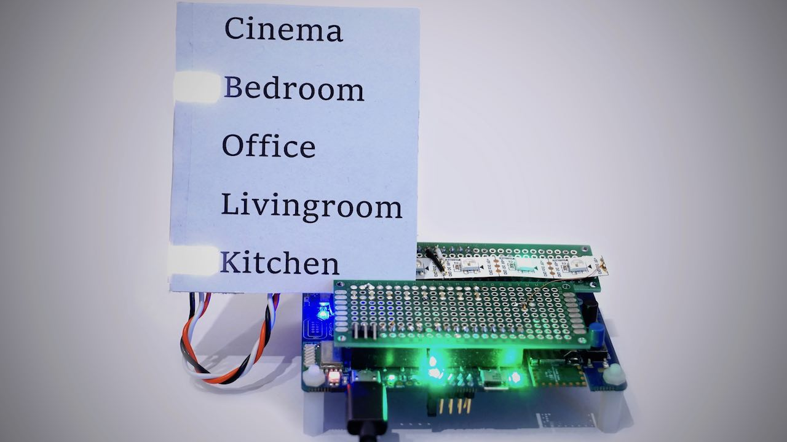

# Edison - Keyword Spotting on MCU [](https://travis-ci.com/noah95/edison)



In my first project on the topic of Machine Learning I implemented a simple keyword spotting algorithm on a Microcontroller. In this post I will walk you through the steps of implementing and testing feature extraction and a neural network on a MCU!

For an overview, check out my write-up here: [https://hütter.ch/posts/edison-kws-on-mcu/](https://hütter.ch/posts/edison-kws-on-mcu/)

## Setup
Download pre-processed audio data, train the model, implement it and compile the MCU code.

```bash
# clone and setup
git clone https://github.com/noah95/edison
cd edison
python3 -m pip install --user virtualenv
source bootstrap.sh

# fetch training data and pre-trained model
curl -L https://github.com/noah95/edison/releases/download/v2.0.0-RC1/keywords-8-noah.tar.gz | tar xvz
curl -L https://github.com/noah95/edison/releases/download/v2.0.0-RC1/kws_model.h5 -o cache/kws_keras/kws_model.h5

# train model
./main.py train keras train
cp cache/kws_keras/kws_model.h5 ../firmware/src/ai/cube/kws/kws_model.h5
```

- open cube project firmware/CubeMX/edison.ioc
- Additional Software -> STMicro... -> kws
- Browse: select firmware/src/ai/cube/kws/kws_model.h5
- Analyse
- click GENERATE CODE

```bash
# import net to firmware folder
cd ../firmware/
make import-cubeai-net

# build MCU code
make -j8

# Flash board
make flash
```

## Train and build with Cube
```bash
# train model
./main.py train keras train
cp cache/kws_keras/kws_model.h5 ../firmware/src/ai/cube/kws/kws_model.h5
```

Analyze in cube as mentioned above.

```bash
# import net to firmware folder
cd ../firmware/
make import-cubeai-net

# build MCU code
make clean && make NET_TYPE=NET_TYPE_CUBE -j16
```

## Train and build with NNoM
Make sure you trained with keras before because the feature extraction step is made there. Then run:

```bash
# train NNoM model
 ./main.py train nnom train

# import net to firmware folder
cd ../firmware/
make import-nnom-net

# build MCU code
make clean && make NET_TYPE=NET_TYPE_NNOM -j16

# Test with
./main.py train nnom testfile data/edison
```


## Experimenting with MFCC

### Understanding MFCC
This script runs MFCC on a audio sample with a custom implementation of MFCC and with Tensorflow.

```bash
./main.py mfcc host
```


## Interfacing with MCU
Build the firmware and follow these instructions to get some data.

### MFCC Single
To test a single 1024 element frame of audio data, run in the `audio` directory
```bash
./main.py mfcc mcu single
```


### MFCC on audio file
Working and tested at 6ddbdc4.

```bash
./main.py mfcc mcu file data/edison_16k_16b.wav
```


### Inference on MCU
A sound file on the host can be sent to the MCU where it is processed and a single inference is run. The result is compared with the same operations on the host.

```bash
./main.py kws mcu file data/edison_16k_16b.wav
# host prediction: [0.973 0.004 0.002 0.    0.    0.001 0.014 0.001 0.004 0.   ] edison
# mcu prediction:  [0.929 0.008 0.009 0.001 0.003 0.002 0.011 0.003 0.028 0.006] edison
# rmse: 0.016304305
# _________________________________________________________________
# Comparing: predictions
# Deviation: max 24.428% min -3983.088% avg -818.319%
# rmse 0.016
# scale 0.955=1/1.048
# correlation coeff 1.000
# _________________________________________________________________
# _________________________________________________________________
# Comparing: MFCC=net input
# Deviation: max 5873.424% min -51588.922% avg -105.840%
# rmse 2.036
# scale 0.959=1/1.043
# correlation coeff 0.997
# _________________________________________________________________
# MCU Audio processing took 72.23ms (2.33ms per frame)
# MCU inference took 97.17ms
```


### Inference with microphone data on MCU
Run entire pipeline on MCU with mircophone data.

```bash
./main.py kws mcu mic
# host prediction: [0.01  0.035 0.007 0.001 0.006 0.011 0.01  0.017 0.289 0.613] _noise
# mcu prediction:  [0.805 0.006 0.009 0.07  0.004 0.003 0.004 0.004 0.093 0.001] edison
# rmse: 0.3242575
```


### Continuous inference with Microphone
Open the serial port from the ST-link board with `115200` baud and send a `4` character. This starts a continuous 
inference with data from the microphone.

## From Model to MCU
Or how to implement a neural network on the microcontroller.

### Using CubeMX
1. Open CubeMX
2. Make sure X-CUBE-AI inst installed under Help -> Manage packages -> STMicroelectronics
3. Access to board selector
4. Search for L475 and select board
5. Say No to initialize to default mode
6. Enable USART1
7. Additional Software -> X-CUBE-AI core selection
8. Artificial Intelligence Application to Validation
9. Platform settings: select USART1 for communication
10. Add network, Keras, Saved model, load .h5
11. Select compression, then hit analyze
12. Generate code with Makefile toolchain
13. To copy the generated code from cube to the firmware directory, run in `firmware`
```bash
make import-cubeai-net
make clean && make -j8 OPMODE=CUBE_VERIFICATION
```
14. Flash target
```bash
make flash
```
15. In Cube, hit validate on target to get funky stuff

### NNoM

**Use tensorflow 1.x for NNoM!!!**
```bash
pip install tensorflow==1.15
```

After creating weights file, go to firmware directory and run
```bash
make import-nnom-net
make clean && make -j8 OPMODE=NNOM_VERIFICATION
```

### Test
To test a net on the MCU and compare it to the host, use the `kws_on_mcu.py` program. Several modes exits:

**Single inference with random data**
Generates random test data and runs inference on host and MCU.

```bash
# 1: number of random test vectors to run
./main.py kws mcu single 1
# host prediction: [0.001 0.005 0.001 0.    0.001 0.001 0.004 0.022 0.01  0.953] _noise
# mcu prediction:  [0.007 0.019 0.001 0.002 0.004 0.006 0.03  0.091 0.037 0.802] _noise
# rmse: 0.054266647
# _________________________________________________________________
# Comparing: predictions
# Deviation: max 27.728% min -643.447% avg -313.669%
# rmse 0.054
# scale 0.841=1/1.189
# correlation coeff 0.996
# _________________________________________________________________
```

**Inference from wav file**
Reads a wav file, computes MFCC on host and runs inference on host and MCU.

```bash
./main.py kws mcu fileinf data/edison_16k_16b.wav
# host prediction: [0.973 0.004 0.002 0.    0.    0.001 0.014 0.001 0.004 0.   ] edison
# mcu prediction:  [0.965 0.006 0.006 0.001 0.002 0.001 0.004 0.001 0.011 0.003] edison
# rmse: 0.004834224
# _________________________________________________________________
# Comparing: predictions
# Deviation: max 68.465% min -2318.963% avg -405.016%
# rmse 0.005
# scale 0.992=1/1.008
# correlation coeff 1.000
# _________________________________________________________________
```

**MFCC and inference from wav file**
Reads a wav file, computes MFCC and inference on host and MCU.

```bash
./main.py kws mcu file data/edison_16k_16b.wav
# host prediction: [0.973 0.004 0.002 0.    0.    0.001 0.014 0.001 0.004 0.   ] edison
# mcu prediction:  [0.929 0.008 0.009 0.001 0.003 0.002 0.011 0.003 0.028 0.006] edison
# rmse: 0.016304305
# _________________________________________________________________
# Comparing: predictions
# Deviation: max 24.428% min -3983.088% avg -818.319%
# rmse 0.016
# scale 0.955=1/1.048
# correlation coeff 1.000
# _________________________________________________________________
# _________________________________________________________________
# Comparing: MFCC=net input
# Deviation: max 5873.424% min -51588.922% avg -105.840%
# rmse 2.036
# scale 0.959=1/1.043
# correlation coeff 0.997
# _________________________________________________________________
# MCU Audio processing took 71.92ms (2.32ms per frame)
# MCU inference took 97.17ms
```

## Development

### Store snapshot of training data
This can then be uploaded to a github release asset.

```bash
cd audio/
tar -czvf keywords-4-noah.tar.gz .cache/allinone/*.npy
```


