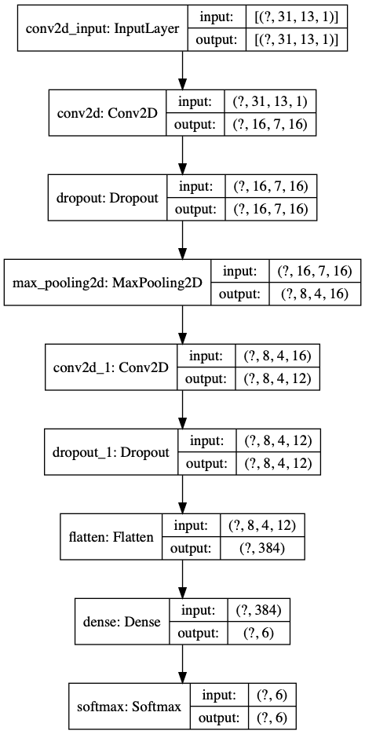

# Edison - Low Power Voice Commands [](https://travis-ci.com/noah95/edison)

## Setup

```bash
# clone and python env setup
git clone https://github.com/noah95/edison
cd edison
source bootstrap.sh

# fetch training data
curl -L https://github.com/noah95/edison/releases/download/v1.0/keywords-4-noah.tar.gz | tar xvz

# train model
python allinone.py train

# copy model to firmware directory and convert using Cube
cp .cache/allinone/kws_model.h5 ../firmware/src/ai/cube/kws/kws_model.h5
mkdir -p ../firmware/build/cube/
# <-- open cube, load model, analyze and generate source code -->

# build MCU code
cd ../firmware/
make -j8

# Flash board
make flash
```

### Store snapshot of training data
This can then be uploaded to a github release asset.

```bash
cd audio/
tar -czvf keywords-4-noah.tar.gz .cache/allinone/*.npy
```


## Comparing networks
Different implementation techniques are compared.

### Reference model
The reference `medium_embedding_conv` model contains two conv2D layers and a fully connected output layer. It matches 4 keywords and is trained on hot/coldwords and noise.

```
keywords = ['cat','marvin','left','zero']
coldwords=['bed','bird','stop','visual']
noise=['_background_noise_']

input shape (31, 13, 1)
output shape (1, 1, 6)
```



### Methods

To compare differenc methods, a few keywords are used to perform on MCU. The rmse values are then averaged.

```bash
python kws_on_mcu.py file verification/marvin.wav | grep rmse
python kws_on_mcu.py file verification/zero.wav | grep rmse
python kws_on_mcu.py file verification/cat.wav | grep rmse
python kws_on_mcu.py file verification/left.wav | grep rmse
python kws_on_mcu.py file verification/stop.wav | grep rmse
```

#### Keras, CubeAI
The net is build with keras and implemented using CubeAI. No quantization/compression is done.

### Results

| Method        | Inference time | MFCC time | `DEBUG` | Opt   | MACC   | RAM    | ROM     | RMSE avg      |
|:--------------|:---------------|:----------|:--------|:------|:-------|:-------|:--------|:--------------|
| Keras, CubeAI | 22.54ms        | 18.25ms   | 1       | `-O0` | 219638 | 3.42KB | 25.74KB | 0.01195651532 |
| Keras, CubeAI | 22.53ms        | 2.97ms    | 0       | `-O3` | 219638 | 3.42KB | 25.74KB | 0.01195651532 |
| Keras, NNoM, CMSIS-NN   | 14.32ms        | 2.21ms    | 0       | `-O3` | 214300 | KB | KB | 0.01195651532 |


## Experimenting with MFCC

### Understanding MFCC
This script runs MFCC on a audio sample with a custom implementation of MFCC and with Tensorflow.

```bash
python mfcc.py
```


## Interfacing with MCU
Build the firmware and follow these instructions to get some data.

### MFCC Single
Working and tested at f86859f.

To test a single 1024 element frame of audio data, run in the `audio` directory
```bash
python mfcc_on_mcu.py single
```


### MFCC on audio file
Working and tested at 6ddbdc4.

```bash
python mfcc_on_mcu.py file data/heysnips_true_16k_16b.wav
```


### Inference on MCU
A sound file on the host can be sent to the MCU where it is processed and a single inference is run. The result is compared with the same operations on the host.

```bash
python kws_on_mcu.py file data/heysnips_true_16k_16b.wav
# host prediction: 0.000000 mcu prediction: 0.000001
# _________________________________________________________________
# Number of inferences run: 1
# Deviation: max -74633.805% min -74633.805% avg -74633.805%
# rmse 0.000
# _________________________________________________________________
# MCU Audio processing took 974.02ms (15.71ms per frame)
# MCU inference took 34.26ms
```


### Inference with microphone data on MCU
Run entire pipeline on MCU with mircophone data.

```bash
python kws_on_mcu.py mic
# Host prediction: 0.85339564 MCU prediction: 0.117089234
```


### Continuous inference with Microphone
Open the serial port from the ST-link board with `115200` baud and send a `4` character. This starts a continuous inference with
data from the microphone.

## From Model to MCU

### Using CubeMX

1. Open CubeMX
2. Make sure X-CUBE-AI inst installed under Help -> Manage packages -> STMicroelectronics
3. Access to board selector
4. Search for L475 and select board
5. Say No to initialize to default mode
6. Enable USART1
7. Additional Software -> X-CUBE-AI core selection
8. Artificial Intelligence Application to Validation
9. Platform settings: select USART1 for communication
10. Add network, Keras, Saved model, load .h5
11. Select compression, then hit analyze
12. Generate code with Makefile toolchain
13. To copy the generated code from cube to the firmware directory, run in `firmware`
```bash
make import-cubeai-net
make clean && make -j8 OPMODE=CUBE_VERIFICATION
```
14. Flash target
```bash
make flash
```
15. In Cube, hit validate on target to get funky stuff

### NNoM

**Use tensorflow 1.x for NNoM!!!**
```bash
pip install tensorflow==1.15
```

After creating weights file, go to firmware directory and run
```bash
make import-nnom-net
make clean && make -j8 OPMODE=NNOM_VERIFICATION
```

### Test
To test a net on the MCU and compare it to the host, use the `kws_on_mcu.py` program. Several modes exits:

**Single inference with random data**
Generates random test data and runs inference on host and MCU.

```bash
# 5: number of random test vectors to run
python kws_on_mcu.py single 5
```

**Inference from wav file**
Reads a wav file, computes MFCC on host and runs inference on host and MCU.

```bash
# File with hotword
python kws_on_mcu.py fileinf data/snips/audio_files/43654f5b-c51c-40fc-9a03-6b0fbb3c366f.wav
# File without hotword
python kws_on_mcu.py fileinf data/snips/audio_files/26eb7524-6f7a-41f4-80e3-a0c374542f1a.wav
```

**MFCC and inference from wav file**
Reads a wav file, computes MFCC and inference on host and MCU.

```bash
# File with hotword
python kws_on_mcu.py file data/snips/audio_files/43654f5b-c51c-40fc-9a03-6b0fbb3c366f.wav
# File without hotword
python kws_on_mcu.py file data/snips/audio_files/26eb7524-6f7a-41f4-80e3-a0c374542f1a.wav
```


